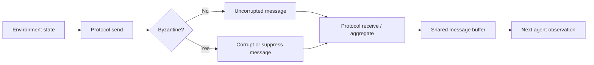

# Byzantine-Resilient Communication for Multi-Agent Reinforcement Learning

A portfolio extract from a five-person MSc team project studying how adversarial communication affects cooperative multi-agent reinforcement learning (MARL).

My role in the original project was **Byzantine & Communications Lead**. I designed and implemented the communication layer, four Byzantine attack behaviours, and the resilient aggregation protocols included here.

> **Team-project note:** this repository is intentionally not a copy of the full team codebase. It focuses on my contribution and includes only a small standalone compatibility layer so the communication components can be inspected and tested independently. The original team repository is linked below for full project context and commit history.

**Original team repository:** https://github.com/yshkrum/marl-byzantine-pursuit

## Project context

The wider project used a cooperative pursuit environment with eight seeker agents on a 16×16 grid. MAPPO (centralised training, decentralised execution) was compared with an independent PPO control while communication was exposed to Byzantine faults.

The experimental design covered:

- four Byzantine attack types
- four communication / aggregation protocols
- Byzantine fractions from 0 to 0.5
- two observability regimes
- 30,000 evaluation episodes in the final sweep

The purpose of my subsystem was to make the communication channel explicit, corruptible and testable without changing the agents' movement policy.

## My contribution

### Byzantine attack models

I implemented four communication-only adversaries:

| Attack | Behaviour |
|---|---|
| Random noise | Replaces the reported hider position with a uniformly random grid location |
| Misdirection | Reports the reflection of the true hider position through the sender's position |
| Spoofing | Keeps message content but forges the sender identity |
| Silence | Suppresses the outgoing message entirely |

The misdirection attacker is intentionally **omniscient** and represents a worst-case adversary.

### Communication protocols

I implemented the protocol interface and four communication strategies:

| Protocol | Role |
|---|---|
| Broadcast | Unfiltered all-to-all baseline |
| Gossip | Bandwidth-limited random fanout |
| Trimmed mean | Robust coordinate-wise aggregation that removes extreme reports |
| Reputation | Online trust scoring that down-weights or excludes inconsistent senders |

A no-communication baseline is also included in the interface module.

## Communication pipeline



Movement remains unchanged. Byzantine behaviour acts only on outgoing
communication, making degradation attributable to the communication channel
rather than an altered movement policy.

### Important implementation detail

In the final team implementation, the communicating protocols
(`Broadcast`, `Gossip`, `TrimmedMean`, and `Reputation`) construct their honest
message from `EnvState.true_hider_pos`. The environment populates that field
directly from the hider's true position.

That means the reported experiments use an **oracle-style shared position
channel**: an honest sender can transmit the true hider position even when its
own visibility-limited observation would not contain that position. This is
faithful to the code that produced the team results, so the portfolio extract
preserves it rather than silently changing the experiment.

The results should therefore be interpreted as a study of Byzantine corruption
and robust aggregation under this oracle-style communication channel, **not**
as evidence of performance under purely local sensing.

`NoneProtocol` remains the local-observation/no-communication control in this
standalone extract.

## Headline results from the full team experiment

The original project evaluated frozen MAPPO and iPPO checkpoints across 30,000 episodes.

### Honest communication baseline

| Observability regime | MAPPO | iPPO | MAPPO - iPPO |
|---|---:|---:|---:|
| Wide FoV (`r=7`) | 68.3% | 52.0% | +16.3 pp |
| Narrow FoV (`r=3`) | 97.3% | 47.0% | +50.3 pp |

### Broadcast degradation at Byzantine fraction `f=0.5`

| Attack | Wide FoV change | Narrow FoV change |
|---|---:|---:|
| Misdirection | -19.6 pp | -33.6 pp |
| Silence | -9.4 pp | -48.3 pp |
| Random noise | -9.3 pp | -10.6 pp |
| Spoofing | ~0 pp | ~0 pp |

The narrow-observability regime was particularly sensitive to information loss: silent communication reduced the MAPPO capture rate by roughly 48 percentage points at `f=0.5`. Spoofing had little effect in this implementation because the policy consumed messages through fixed observation slots rather than using the transmitted sender identity as a decision feature.

These values are reproduced from the final team repository's documented
evaluation summary. See [`results/RESULTS.md`](results/RESULTS.md) and
[`docs/IMPLEMENTATION_LIMITATION.md`](docs/IMPLEMENTATION_LIMITATION.md) for
the experiment-specific caveat around the communication signal.

## Repository structure

```text
byzantine-resilient-marl-comms/
├── src/
│   ├── common.py
│   ├── byzantine/
│   │   └── subtypes.py
│   └── comms/
│       ├── interface.py
│       ├── broadcast.py
│       ├── gossip.py
│       ├── trimmed_mean.py
│       └── reputation.py
├── tests/
│   └── test_components.py
├── results/
│   ├── headline_results.csv
│   └── RESULTS.md
├── docs/
│   ├── PROJECT_CONTEXT.md
│   ├── MY_CONTRIBUTION.md
│   └── IMPLEMENTATION_LIMITATION.md
├── requirements.txt
├── .gitignore
└── NOTICE.md
```

## Running the standalone extract

```bash
python -m venv .venv

# Windows
.venv\Scripts\activate

# macOS / Linux
source .venv/bin/activate

pip install -r requirements.txt
pytest -q
```

This extract does **not** include the team-owned pursuit environment, MAPPO/iPPO training code, checkpoints or experiment runner. The included `src/common.py` is a small compatibility layer created for this portfolio version so my communication components can be imported without copying the rest of the team system.

## What I learned

The project made the difference between model robustness and communication robustness very concrete. A policy can look strong under honest information but become highly dependent on how peer observations are shared, filtered and trusted. It also showed that a defence is not universally best: protocol behaviour depends on the failure mode, observability and how the receiving policy actually consumes messages.

## Attribution

This was a **five-person team project**. I was responsible for the Byzantine and communication subsystem represented in this repository. The complete team implementation, including environment design and reinforcement-learning components owned by other team members, remains in the original repository:

https://github.com/yshkrum/marl-byzantine-pursuit
